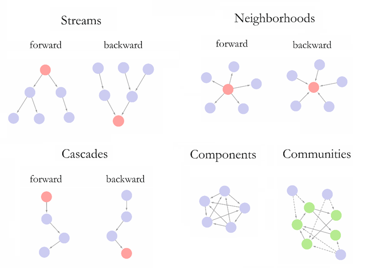
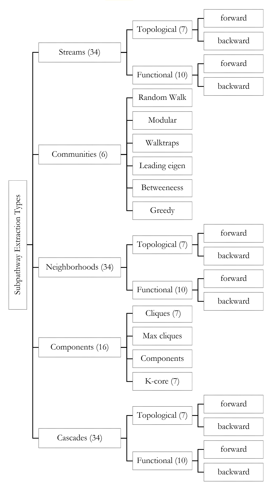
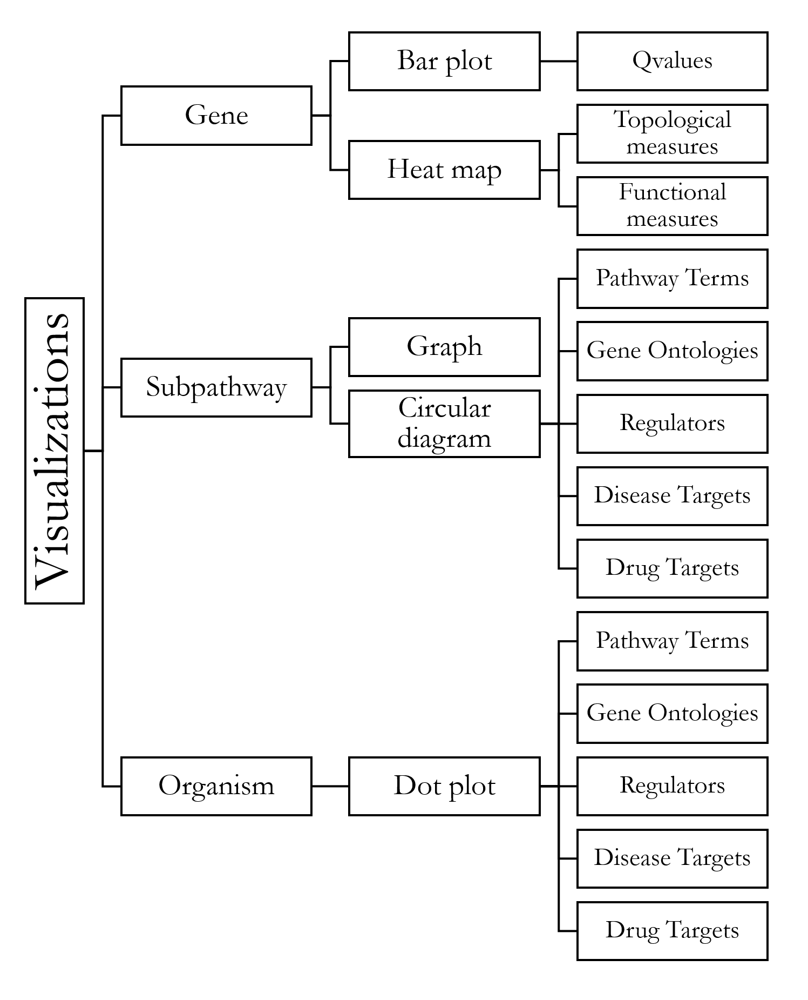

# Table of Contents
1. [Package setup](#Package setup)
2. [User input](#User input)
3. [Pathway network construction](#Pathway network construction)
4. [Pathway network processing](#Pathway network processing)
5. [Subpathway extraction](#Subpathway extraction)
6. [Subpathway enrichment analysis](#Subpathway enrichment analysis)
7. [Visualization](#Visualization)

## 1. Package Setup
DEsubs is a network-based systems biology R package that extracts 
disease-perturbed subpathways within a pathway network as recorded by 
RNA-seq experiments. It contains an extensive and customizable framework 
with a broad range of operation modes at all stages of the subpathway 
analysis, enabling a case-specific approach. The operation modes refer to 
the pathway network construction and processing, the subpathway extraction,
visualization and enrichment analysis with regard to various biological and
pharmacological features. It's capabilities render it a valuable tool for both 
the modeler and experimentalist searching for the identification of more robust
systems-level drug targets and biomarkers for complex diseases.

Before loading the package, please specify a user-accessible home directory 
using the following commands, which currently reflect the default directories 
for each architecture:

```{r eval=TRUE, echo=TRUE}
if (.Platform[['OS.type']] == 'unix') 
{ 
    options('DEsubs_CACHE'=file.path(path.expand("~"), 'DEsubs') ) 
}
if (.Platform[['OS.type']] == 'windows') 
{ 
    options('DEsubs_CACHE'=file.path(
            gsub("\\\\", "/", Sys.getenv("USERPROFILE")), "AppData/DEsubs"))
}
```

Now the package, as well as the toy-data can be loaded as follows:

```{r eval=FALSE, echo=TRUE}
library('DEsubs')

load(system.file('extdata', 'data.RData', package='DEsubs'))
```


```{r setup, echo=FALSE, include=FALSE }
# set global chunk options: 

if (.Platform[['OS.type']] == 'unix') 
{ 
    options('DEsubs_CACHE'=file.path(path.expand("~"), 'DEsubs') ) 
}
if (.Platform[['OS.type']] == 'windows') 
{ 
    options('DEsubs_CACHE'=file.path(
            gsub("\\\\", "/", Sys.getenv("USERPROFILE")), "AppData/DEsubs"))
}

library(knitr)
library('DEsubs')
load(system.file('extdata', 'data.RData', package='DEsubs'))
```

\newpage

## 2. User Input
DEsubs accepts RNA-seq expression paired case-control profile data. The following 
example in Table 1 shows the right structure for RNA-seq expression data input.


Gene               Case 1    Case 2    Case 3    Case 4    Control 1 Control 2 Control 3 Control 4
------------------ --------- --------- --------- --------- --------- --------- --------- ---------
Gene 1             1879      2734      2369      2636      2188      9743      9932      10099
Gene 2             97        124       146       114       126       33        19        31
Gene 3             485       485       469       428       475       128       135       103
...                ...       ...       ...       ...       ...       ...       ...       ...
Gene N-1           84        25        67        62        61        277       246       297
Gene N             120       312       78        514       210       324       95        102
------------------ --------- --------- --------- --------- --------- --------- --------- ---------
Table: Example of user input format


## 3. Pathway network construction
KEGG signaling pathway maps have been downloaded and converted to pathway 
networks using CHRONOS package. Pathway networks for the seven supported 
organisms are included in the package itself (see Table 2). 


Supported Organisms                      R command
--------------                           ----------------
Homo sapiens                             'hsa'
Mus musculus                             'mmu'
Drosophila melanogaster                  'dme'
Saccharomyces cerevisiae                 'sce'
Arabidopsis thaliana                     'ath'
Rattus norvegicus                        'rno'
Danio rerio                              'dre'
--------------                           ----------------
Table: Supported KEGG organisms


DEsubs operates with Entrez ID labels, however twelve other label systems 
are supported after converting to Entrez IDs via a lexicon included in 
the package itself (see Table 3). 


Supported Labels              R command
------------                  ----------------
Entrez                        'entrezgene'
Ensemble                      'ensembl_gene_id', 'ensembl_transcript_id'
                              'ensembl_peptide_id'
HGNC                          'hgnc_id', 'hgnc_symbol', 'hgnc_transcript_name'
Refseq                        'refseq_mrna', 'refseq_peptide'
------------                  ----------------
Table: Supported gene labels


\newpage

## 4. Pathway network processing

Next, the RNA-seq data are mapped onto the nodes and edges of the pathway 
network and two the pruning rules are applied to isolate interactions of 
interest among statistically significant differentially expressed genes 
(DEGs). DEGs are identified using the differential expression analysis tools 
in Table 5 by considering the FDR-adjusted P-value of each gene (Q-value). 
Instead of selecting one tools in Table 5, the user can import a custom 
ranked list of genes accompanied by their Q-values (argument *rankedList*). 

Based on this information, the NodeRule prunes the nodes of the original 
network G=(V,E), where Q-threshold (argument *DEpar*) defaults to 0.05:

$$ Qvalue(i) < Q.threshold, i \in V $$

Next, the interactions among the selected genes are pruned based on both
prior biological knowledge and the expression profiles of neighbouring genes,
, where C-threshold defaults to 0.6 (argument *CORpar*):

$$ cor(i,j)*reg(i,j) > C.threshold, , i,j \in V $$

If genes i,j are connected with an edge with an activation type, then reg 
is set to 1, while if it the activation type is inhibitory, it is set to -1.
The correlation between the profiles of the two genes i, j is calculated 
using the measures in Table 4 (argument *CORtool*).  


```{r, eval=TRUE, echo=FALSE}


DEsubs.run <- DEsubs(   org='hsa', 
                        mRNAexpr=mRNAexpr, 
                        mRNAnomenclature='entrezgene', 
                        pathways='All', 
                        DEtool=NULL, 
                        DEpar=0.05,
                        CORtool='pearson', 
                        CORpar=0.7, 
                        subpathwayType=NULL,
                        rankedList=rankedList, verbose=FALSE)
```


Type                                                R command
--------------                                      ----------------
Pearson product-moment correlation coefficient      'pearson'
Spearman rank correlation coefficient               'spearman'
Kendall rank correlation coefficient                'kedhall'
--------------                                      ----------------
Table: Edge Rule options


Supported Labels                                    R command
--------------                                      ----------------
[@robinson2010edger]                                'edgeR'
[@anders2010differential]                           'DESeq'
[@leng2013ebseq]                                    'EBSeq'
[@smyth2004linear]                                  'vst+limma'
[@anders2010differential]; [@smyth2004linear]       'voom+limma'
[@li2013finding]                                    'samr'
[@di2011nbp]                                        'NBPSeq'
[@auer2011two]                                      'TSPM'
--------------                                      ----------------
Table: Node Rule options


## 5. Subpathway Extraction 

### 5.1. Main Categories

Subpathway extraction is based on five main categories, (i) components, 
(ii) communities, (iii) streams, (iv) neighborhoods, (v) cascades. Each one 
sketches different topological aspect within the network. Indicative examples 
and a short description of DEsubs five main subpathway categories can be found 
in Figure 1.


```{r eval=TRUE, echo=FALSE, out.height='235px', fig.align='center', fig.cap=cap, fig.pos='h', out.extra=''}

cap <- paste0(
    'Stream, neighborhood and cascade types build each subpathway ',
    '(blue nodes) by starting from a gene of interest (red nodes). ',
    'Components and communities are densely linked group of genes with the ',
    'difference that the genes sharing common properties are maintained ',
    'within the graph (green nodes).')


```


The component category extracts strongly connected group of genes 
indicating dense local areas within the network. The community category 
extracts linked genes sharing a common property within the network. 
Thus the user can observe local gene sub-areas with a specific role within 
the network. Cascade, stream and neighborhood categories are generated 
starting from a gene of interest (GOI) in order to view the local 
perturbations within the network from different points of interest. 
The generation is performed by traversing either the forward or the 
backward propagation that stems from the GOI and is illustrated via three 
different topological schemes, gene sequences ('cascade' category), 
gene streams ('stream' category) and gene direct neighbors 
('neighborhood' category). 


### 5.2. Gene of interest (GOI)

Genes having crucial topological or functional roles within the network are 
considered as GOIs (see Table 6). The topological roles are portrayed using 
various topological measures from igraph package [@csardi2006igraph] 
capturing the local as well as global aspects of the network. Genes with 
crucial functional roles are considered as key genes for several 
biological and pharmacological features through $fscore$, a measure which 
estimates how a gene acts as a bridge among specific functional terms. 
In more detail, *fscore* is the number of condition-based functional terms 
in which a gene participates. For a functional condition $fc$ with *n* terms 
and $p_i^j=1$ or 0 if gene(i) participates or not in $term(j)$, the fscore 
of $gene(i)$ is as follows: $$ fscore(i)=\sum_{j=1}^{n}p_i^j $$

A high value of $fscore(i)$ for a condition $j$ indicates that gene $i$ 
participates to several functional terms of condition $j$ 
(for e.g. terms for diseases), hence it operates as a bridge for the terms of 
condition $j$ within the graph. As functional conditions we considered 
various biological and pharmacological features related with pathways, gene 
ontologies, diseases, drugs, microRNAs and transcription factors. 
External references are used to imprint gene associations by each 
feature separately. The references based on the approach of 
[@barneh2015updates]; [@chen2013enrichr]; [@li2011implications]; 
[@vrahatis2016chronos]. Details are shown in Table 6.


Summarizing, a user-defined threshold (namely *top*) is used for the selection 
of GOIs. After the calculation of topological measures and functional 
measures by each condition (through $fscore$), the genes with the top best 
values are considered as GOIs. The parameter top is user-defined with default 
value $top=30$. In GOIs with crucial functional role we add and those having 
the lowest Q-value by each user-defined experimental dataset. Thus, the user 
is allowed to generate subpathways starting from the most statistical 
significant DEGs of his own experiment. A short description for all GOI types 
along with the corresponding parameters are shown in Table 6. 


Type                  Description                                           R command
--------------------- ----------------------------------------------------  ----------------
**Topological**
Degree                Number of adjacent interactions of the gene           'degree'
Betweenness           Number of shortest paths from all vertices to all     'betweenness'
                      others that pass through that node
Closeness             Inverse of farness, which is the sum of distances     'closeness'
                      to all other nodes
Hub score             Kleinbergs hub centrality score                       'hub_score'
Eccentricity          Shortest path distance from the farthest              'eccentricity'
                      node in the graph
Page rank             Google Page Rank                                      'page_rank'
Start Nodes           Nodes without any incoming links                      'start_nodes'
**Functional**
DEG                   Genes highly differentially expressed                 'deg'
                      according to the experimental data
Pathways              Genes acting as bridges among KEGG pathways           'KEGG'
Biological Process    Genes acting as bridges among                         'GO_bp'
                      Gene Ontology Biological Process terms
Cellular Component    Genes acting as bridges among                         'GO_cc'
                      Gene Ontology Cellular Component terms
Molecular Function    Genes acting as bridges among                         'GO_mf'
                      Gene Ontology Molecular Function terms
Disease               Genes acting as bridges for OMIM targets              'Disease_OMIM'
Disease               Genes acting as bridges for GAD targets               'Disease_GAD'
Drug                  Genes acting as bridges for DrugBank targets          'Drug_DrugBank'
microRNA              Genes acting as bridges for microRNA targets          'miRNA'
Transcription Factors Genes acting as bridges for TF targets                'TF'
--------------------- ----------------------------------------------------  ----------------
Table: Gene of interest (GOI) types


### 5.3. All subpathway options

Cascade, stream and neighborhood subpathway types can start from seventeen 
(17) different GOI types and their generation is performed either with 
forward or backward propagation. Thus, thirty-four (34) different types are 
created for each of the three types. Also, the component-based types are 
sixteen and the community-based types are six based on igraph package. 
DEsubs therefore supports 124 subpathway types as described in Tables 7-11.


Description                                     R parameter
----------------------------------------------- ----------------------------------------------- 
**Topological**
Forward and backward streams starting from      'fwd.stream.topological.degree'
genes/nodes with crucial topological roles      'fwd.stream.topological.betweenness'
within the network                              'fwd.stream.topological.closeness'
                                                'fwd.stream.topological.hub_score'
                                                'fwd.stream.topological.eccentricity'
                                                'fwd.stream.topological.page_rank'
                                                'fwd.stream.topological.start_nodes'
                                                'bwd.stream.topological.degree'
                                                'bwd.stream.topological.betweenness'
                                                'bwd.stream.topological.closeness'
                                                'bwd.stream.topological.hub_score'
                                                'bwd.stream.topological.eccentricity'
                                                'bwd.stream.topological.page_rank'
                                                'bwd.stream.topological.start_nodes'
**Functional**
Forward and backward streams starting from      'fwd.stream.functional.GO_bp'
genes/nodes with crucial functional roles       'fwd.stream.functional.GO_cc'
within the network                              'fwd.stream.functional.GO_mf'
                                                'fwd.stream.functional.Disease_OMIM'
                                                'fwd.stream.functional.Disease_GAD'
                                                'fwd.stream.functional.Drug_DrugBank'
                                                'fwd.stream.functional.miRNA'
                                                'fwd.stream.functional.TF'
                                                'fwd.stream.functional.KEGG'
                                                'fwd.stream.functional.DEG'
                                                'bwd.stream.functional.GO_bp'
                                                'bwd.stream.functional.GO_cc'
                                                'bwd.stream.functional.GO_mf'
                                                'bwd.stream.functional.Disease_OMIM'
                                                'bwd.stream.functional.Disease_GAD'
                                                'bwd.stream.functional.Drug_DrugBank'
                                                'bwd.stream.functional.miRNA'
                                                'bwd.stream.functional.TF'
                                                'bwd.stream.functional.KEGG'
                                                'bwd.stream.functional.DEG'
----------------------------------------------- ----------------------------------------------- 
Table: Subpathway Options - STREAM


Description                                     R parameter
----------------------------------------------- ----------------------------------------------- 
**Topological**
Forward and backward neighbourhoods starting    'fwd.neighbourhood.topological.degree'
from genes/nodes with crucial topological       'fwd.neighbourhood.topological.betweenness'
roles within the network                        'fwd.neighbourhood.topological.closeness'
                                                'fwd.neighbourhood.topological.hub_score'
                                                'fwd.neighbourhood.topological.eccentricity'
                                                'fwd.neighbourhood.topological.page_rank'
                                                'fwd.neighbourhood.topological.start_nodes'
                                                'bwd.neighbourhood.topological.degree'
                                                'bwd.neighbourhood.topological.betweenness'
                                                'bwd.neighbourhood.topological.closeness'
                                                'bwd.neighbourhood.topological.hub_score'
                                                'bwd.neighbourhood.topological.eccentricity'
                                                'bwd.neighbourhood.topological.page_rank'
                                                'bwd.neighbourhood.topological.start_nodes'
**Functional**
Forward and backward neighbourhoods starting    'fwd.neighbourhood.functional.GO_bp'
from genes/nodes with crucial topological       'fwd.neighbourhood.functional.GO_cc'
roles within the network                        'fwd.neighbourhood.functional.GO_mf'
                                                'fwd.neighbourhood.functional.Disease_OMIM'
                                                'fwd.neighbourhood.functional.Disease_GAD'
                                                'fwd.neighbourhood.functional.Drug_DrugBank'
                                                'fwd.neighbourhood.functional.miRNA'
                                                'fwd.neighbourhood.functional.TF'
                                                'fwd.neighbourhood.functional.KEGG'
                                                'fwd.neighbourhood.functional.DEG'
                                                'bwd.neighbourhood.functional.GO_bp'
                                                'bwd.neighbourhood.functional.GO_cc'
                                                'bwd.neighbourhood.functional.GO_mf'
                                                'bwd.neighbourhood.functional.Disease_OMIM'
                                                'bwd.neighbourhood.functional.Disease_GAD'
                                                'bwd.neighbourhood.functional.Drug_DrugBank'
                                                'bwd.neighbourhood.functional.miRNA'
                                                'bwd.neighbourhood.functional.TF'
                                                'bwd.neighbourhood.functional.KEGG'
                                                'bwd.neighbourhood.functional.DEG'
----------------------------------------------- ----------------------------------------------- 
Table: Subpathway Options - NEIGHBOURHOOD


Description                                     R parameter
----------------------------------------------- ----------------------------------------------- 
**Topological**
Forward and backward cascades starting          'fwd.cascade.topological.degree'
from genes/nodes with crucial topological       'fwd.cascade.topological.betweenness'
roles within the network                        'fwd.cascade.topological.closeness'
                                                'fwd.cascade.topological.hub_score'
                                                'fwd.cascade.topological.eccentricity'
                                                'fwd.cascade.topological.page_rank'
                                                'fwd.cascade.topological.start_nodes'
                                                'bwd.cascade.topological.degree'
                                                'bwd.cascade.topological.betweenness'
                                                'bwd.cascade.topological.closeness'
                                                'bwd.cascade.topological.hub_score'
                                                'bwd.cascade.topological.eccentricity'
                                                'bwd.cascade.topological.page_rank'
                                                'bwd.cascade.topological.start_nodes'
**Functional**
Forward and backward cascades starting          'fwd.cascade.functional.GO_bp'
from genes/nodes with crucial topological       'fwd.cascade.functional.GO_cc'
roles within the network                        'fwd.cascade.functional.GO_mf'
                                                'fwd.cascade.functional.Disease_OMIM'
                                                'fwd.cascade.functional.Disease_GAD'
                                                'fwd.cascade.functional.Drug_DrugBank'
                                                'fwd.cascade.functional.miRNA'
                                                'fwd.cascade.functional.TF'
                                                'fwd.cascade.functional.KEGG'
                                                'fwd.cascade.functional.DEG'
                                                'bwd.cascade.functional.GO_bp'
                                                'bwd.cascade.functional.GO_cc'
                                                'bwd.cascade.functional.GO_mf'
                                                'bwd.cascade.functional.Disease_OMIM'
                                                'bwd.cascade.functional.Disease_GAD'
                                                'bwd.cascade.functional.Drug_DrugBank'
                                                'bwd.cascade.functional.miRNA'
                                                'bwd.cascade.functional.TF'
                                                'bwd.cascade.functional.KEGG'
                                                'bwd.cascade.functional.DEG'
----------------------------------------------- ----------------------------------------------- 
Table: Subpathway Options - CASCADE


Type               Description                            R parameter
------------------ -------------------------------------  -------------------------------------- 
Random Walk         Community structures that minimize    'community.infomap'
                    the expected description length of
                    a random walker trajectory
Modular             Community structures via a modularity 'community.louvain'
                    measure and a hierarchical approach
Walktraps           Densely connected subgraphs via       'community.walktrap'
                    random walks
Leading eigen       Densely connected subgraphs based     'community.leading_eigen'
                    on the leading non-negative eigen-
                    vector of the modularity matrix
Betweeneess         Community structures detection        'community.edge_betweenness'
                    via edge betweenness
Greedy              Community structures via greedy       'community.fast_greedy'
                    optimization of modularity
------------------ -------------------------------------  -------------------------------------- 
Table: Subpathway Options - COMMUNITY


Type               Description                            R parameter
------------------ -------------------------------------  -------------------------------------- 
Cliques            A subgraph where every two distinct    'component.3-cliques'
                   vertices in the clique are adjacent    ...
                                                          'component.9-cliques'
K-core             A maximal subgraph in which each       'component.3-coreness'
                   vertex has at least degree k           ...
                                                          'component.9-coreness'
Max cliques       Largest of maximal cliques              'component.max_cliques'
Components        All single components                   'component.decompose'
------------------ -------------------------------------  -------------------------------------- 
Table: Subpathway Options - COMPONENT


An example follows where *community.walktrap* is selected as the 
subpathway type. 

```{r, eval=TRUE, echo=TRUE}

DEsubs.run <- DEsubs(
                    org='hsa', 
                    mRNAexpr=mRNAexpr, 
                    mRNAnomenclature='entrezgene', 
                    pathways='All', 
                    DEtool=NULL, DEpar=0.05, 
                    CORtool='pearson', CORpar=0.7,
                    subpathwayType='community.walktrap',
                    rankedList=rankedList, 
                    verbose=FALSE)
```

\newpage


```{r eval=TRUE, echo=FALSE, out.height='575px', fig.align='center', fig.cap=cap}

cap <- paste0(
    'Subpathway extraction options consist of five main categories. ', 
    'The three of them (cascade, neighborhood, stream) are sub-categorized ', 
    'according to features (topological or functional) and the direction of ',
    'propagation (forward or backward) of the gene of interest where each ',
    'subpathway is starting. The other two (component, community) are ',
    'sub-categorized according to various topological properties.')


```


## 6. Subpathway enrichment analysis

Eight different datasets with external resources are stored locally for 
further enrichment analysis of resulting subpathways. Each dataset is formed 
with a list of terms related to biological and pharmacological features and 
the respective associated genes for each term. A detailed description is shown 
in Table 12. Additionally, the user can supply a custom gene-set in the form 
of an *.RData* file storing a matrix, named *targetsPerClass*. 
The matrix should store the terms as rownames and the targets of 
each term at each row. Since some rows are bound to havemore elements that 
others, empty cells should be filled with '0' characters.
Once the file is stored in a directory *DEsubs/Data*, it will be permanently 
availiable along with the other eight resources, using the filename (without 
the *.RData* suffix) as the new functional feature type along with the any of 
the default eight features. 

The enrichment analysis is performed based on the cumulative hypergeometric 
distribution, where G is the number of genes in the user input list, l the 
number of those genes included in the subpathway, D the number of associated 
genes for a term and d the number of genes included in the subpathway 
[@li2013subpathway]. Terms with P < 0.05 are regarded as terms 
with significant association with the respective subpathway.

$$ P = 1 - \sum_{x=0}^{d}\frac{\binom{D}{x}\binom{G-D}{l-x}}{\binom{G}{l}} $$


Type                    Description (# of terms)        Source
--------------          --------------                  --------------
Pathway Term            KEGG pathway maps (179)         [@chen2013enrichr] 
GO Biological Process   Genes sharing a common          [@chen2013enrichr]
                        biological process (5.192)  
GO Cellular Component   Genes sharing a common          [@chen2013enrichr]
                        cellular component (641)  
GO Molecular Function   Genes sharing a common          [@chen2013enrichr]
                        molecular level (1.136)
OMIM Disease            Disease related genes (90)      [@chen2013enrichr] 
GAD Disease             Disease related genes (412)     [@li2011implications]
DrugBank Drug           Gene targets of drugs (1.488)   [@barneh2015updates] 
Transcription Factor    Gene targetsof transcription    [@chen2013enrichr] 
                        factors (290)
--------------          --------------                  --------------
Table: List of external databases


Term      Target 1  Target 2  Target 3  Target 4  Target 5  Target 6  Target 7 
--------- --------- --------- --------- --------- --------- --------- --------- 
Term 1    ACAD9     ACAD8     SH3GLB1   ESCO2     ESCO1     ADH1C     '0'
Term 2    ADH1C     ADH1B     ADHFE1    ADH1A     ADH6      ADH7      ADH4
...       ...       ...       ...       ...       ...       ...       ...              
Term N    PTPN1     RHOA      ACTN4     ACTN3     ACTN2     '0'       '0'
--------- --------- --------- --------- --------- --------- --------- --------- 
Table:  Example of custom gene set


\newpage


## 7. Visualization

DEsubs visualizes its results at a gene, subpathway and organism level through
various schemes such as bar plots, heat maps, directed weighted graphs, 
circular diagrams [@gu2014circlize] and dot plots. Indicative examples are 
illustrated in figures 2-8 based on DEsubs executions using the human pathway 
network and a synthetic dataset. Bar plots show the genes with the best Q-value 
from the user-selected DE analysis tool (the user defines the desired gene 
number). The figures are exported in the directory *Output* within the user 
specified location. Heat maps show the genes with the highest values either 
in our topological or functional measures (see Table 6).


```{r eval=TRUE, echo=FALSE, out.height='385px', fig.align='center', fig.cap=cap, fig.pos='h', out.extra=''}

cap <- paste0(
    'Bar plots show the genes with the best Q-value from the user-selected ',
    'DE analysis tool (the user defines the desired gene number). ',
    'Heat maps show the genes with the highest values either in our ',
    'topological or functional measures (see Table 6). ',
    'Each extracted subpathway is illustrated though a directed graph by ',
    'imprinting the degree of DE and correlation among the respective gene ',
    'members. Subpathway enrichment in association with biological and ',
    'pharmacological features (such as pathway terms, gene ontologies, ',
    'regulators, diseases and drug targets) is depicted through circular ',
    'diagrams. The total picture of the enriched subpathways is performed ', 
    'with dot plots.')


```


\newpage


### 7.1 Gene Level Visualization

```{r,  eval=FALSE, echo=TRUE }

res <- geneVisualization(  
            DEsubs.out=DEsubs.out, top=10, 
            measures.topological=c( 'degree', 'betweenness', 'closeness',
                                    'eccentricity', 'page_rank'),
            measures.functional=c(  'KEGG', 'GO_bp','GO_cc', 'GO_mf', 
                                    'Disease_OMIM', 'Disease_GAD', 
                                    'Drug_DrugBank','miRNA', 'TF'),
            size.topological=c(5,4), 
            size.functional=c(7,4), 
            size.barplot=c(5,6),
            export='plot', verbose=FALSE)
```

```{r, echo=FALSE, fig.width=6.2, fig.height=5.2, fig.cap=cap }

cap <- 'Bars illustrate the genes with the highest Q-values.'

res <- geneVisualization(  
            DEsubs.out=DEsubs.out, 
            top=10,
            measures.topological=NULL,
            measures.functional=NULL,
            measures.barplot=TRUE,
            size.barplot=c(5,6), 
            export='plot',
            verbose=FALSE)
```


```{r, echo=FALSE, fig.width=7, fig.height=4, fig.cap=cap  }

cap <- 'Heat map represents the twelve genes with the highest values of 
functional measures. The values are scaled and the red graduation indicates 
the value degree.'

res <- geneVisualization(  
            DEsubs.out=DEsubs.out, 
            top=12,
            measures.topological=NULL,
            measures.functional=c(  'KEGG', 'GO_bp','GO_cc', 'GO_mf', 
                                    'Disease_OMIM', 'Disease_GAD', 
                                    'Drug_DrugBank','miRNA', 'TF'),
            measures.barplot=FALSE,
            size.functional=c(7,4), 
            export='plot',
            verbose=FALSE)
```


```{r, echo=FALSE, fig.width=5, fig.height=4, fig.align="center", fig.cap=cap }

cap <- 'Heat map represents the twelve genes with the highest values of 
topological measures. The values are scaled and the red graduation indicates 
the value degree.'

res <- geneVisualization(  
            DEsubs.out=DEsubs.out, 
            top=12,
            measures.topological=c( 'degree', 'betweenness', 'closeness',
                                    'eccentricity', 'page_rank'),
            measures.functional=NULL,
            measures.barplot=FALSE,
            size.topological=c(5,4), 
            export='plot',
            verbose=FALSE)
```


\newpage


### 7.2. Subpathway Level Visualization
Each extracted subpathway is illustrated though a directed graph by imprinting 
the degree of differential expression and correlation among the respective 
gene members. Additionally, it can be extracted in a variety of formats so 
that it can be used by external software, such as *.txt*, *.json*, *.gml*,
*.ncol*, *.lgl*, *.graphml* and *.dot* formats.      


```{r, eval=FALSE, echo=TRUE }

res <- subpathwayToGraph(
                    DEsubs.out=DEsubs.out, 
                    submethod='community.walktrap', 
                    subname='sub6', verbose=FALSE,
                    export=c('plot', 'gml', 'edgelist') )
```


```{r, echo=FALSE, fig.width=3.5, fig.height=3.5, fig.cap=cap }

library('DEsubs')
load(system.file('extdata', 'data.RData', package='DEsubs'))

cap <- 'Graph illustrates the links of a subpathway. Red graduation 
in nodes indicate the Q-value degree, the edge width indicates the correlation
degree between the respective genes. Green or red color in edges indicates 
the positive or negative correlation respectively'

res <- subpathwayToGraph( 
                    DEsubs.out=DEsubs.out, 
                    submethod='community.walktrap', 
                    subname='sub6', 
                    verbose=FALSE,
                    export=c('plot', 'gml', 'edgelist') )
```

Subpathway enrichment in association with biological and pharmacological 
features (such as pathway terms, gene ontologies, regulators, diseases and 
drug targets) is depicted through circular diagrams.


```{r, eval=FALSE, echo=TRUE }

res <- subpathwayVisualization( 
                    DEsubs.out=DEsubs.out,  
                    references=c('GO', 'TF'), 
                    submethod='community.walktrap', 
                    subname='sub1', 
                    scale=c(1, 1), 
                    export='plot', 
                    verbose=FALSE)

```

```{r, echo=FALSE, fig.width=3.8, fig.height=3.8, fig.cap=cap }

cap <- 'Circular Diagram shows the associations among genes including in a 
subpathway and Gene Ontology terms where are enriched'

library('DEsubs')
load(system.file('extdata', 'data.RData', package='DEsubs'))

res <- subpathwayVisualization( 
                    DEsubs.out=DEsubs.out,  
                    references='GO', 
                    submethod='community.walktrap', 
                    subname='sub1', 
                    scale=1, 
                    export='plot', 
                    verbose=FALSE)
```

```{r, echo=FALSE, fig.width=4.0, fig.height=4.0, fig.cap=cap }

cap <- 'Circular Diagram shows the associations among genes included in a 
subpathway and enriched Transcription Factors.'


res <- subpathwayVisualization( 
                    DEsubs.out=DEsubs.out,  
                    references='TF', 
                    submethod='community.walktrap', 
                    subname='sub1', 
                    scale=1.0, 
                    export='plot', 
                    verbose=FALSE)
```

\newpage

### 7.3. Organism Level Visualization

The total picture of the enriched subpathways is performed with dot plots. 
The number of features represented are selected using *topTerms* argument.

```{r, eval=FALSE, echo=TRUE}

res <- organismVisualization( 
                    DEsubs.out=DEsubs.out, 
                    references='KEGG', 
                    topSubs=10, 
                    topTerms=20, 
                    export='plot', 
                    verbose=FALSE)
```

```{r, echo=FALSE, fig.width=7.4, fig.height=6, fig.cap=cap}

cap <- 'Dot plot shows the enriched associations among experiment-specific 
extracted subpathways and pathwaysfrom KEGG database. 
Twenty pathways were selected as the desired number of terms.'


res <- organismVisualization( 
            DEsubs.out=DEsubs.out, 
            references='KEGG', 
            topSubs=10, topTerms=20, 
            export='plot', verbose=FALSE)
```


# References
